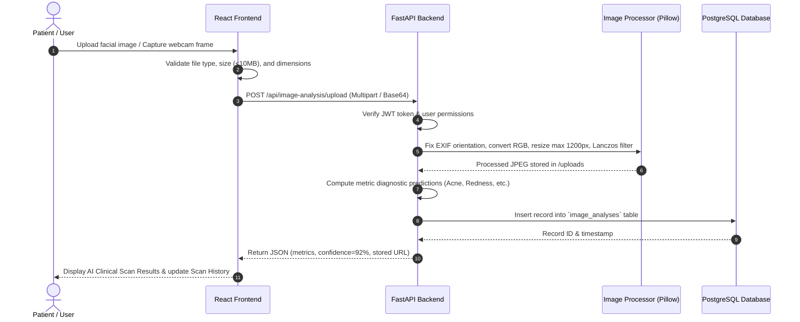

# 🏗️ System Architecture & Engineering Specifications

This document details the system architecture, component dependencies, security boundaries, and data flow models of the **AI Skin Intelligence & Personalized Skincare Planner**.

---

## 1. System Overview & Layering

```mermaid
graph TB
    subgraph Client Layer (Browser)
        ReactSPA[React 18 Single Page Application]
        State[AuthContext & Local State]
        ViteAssets[Vite Bundled Assets & Design System]
    end

    subgraph Security & Access Layer
        CorsMiddleware[CORS Middleware & Header Protection]
        AuthGuard[JWT Cookie / Bearer Verification]
        RoleEnforcer[RBAC Authorization Middleware]
    end

    subgraph API Gateway & Service Layer (FastAPI)
        RouterAuth[/api/auth Router]
        RouterAssessment[/api/assessment Router]
        RouterImage[/api/image-analysis Router]
        RouterRoutines[/api/routines Router]
        RouterIngredients[/api/ingredients Router]
        RouterClinical[/api/clinical Router]
        RouterReports[/api/reports Router]
    end

    subgraph Processing & Storage Layer
        PillowProc[Pillow Image Preprocessor]
        SQLAlchemy[SQLAlchemy ORM Data Mapper]
        Postgres[(PostgreSQL Database)]
        LocalStorage[Static Uploads File Storage]
    end

    ReactSPA -->|HTTP Requests| CorsMiddleware
    CorsMiddleware --> AuthGuard
    AuthGuard --> RoleEnforcer
    RoleEnforcer --> RouterAuth
    RoleEnforcer --> RouterAssessment
    RoleEnforcer --> RouterImage
    RoleEnforcer --> RouterRoutines
    RoleEnforcer --> RouterIngredients
    RoleEnforcer --> RouterClinical
    RoleEnforcer --> RouterReports

    RouterImage --> PillowProc
    PillowProc --> LocalStorage
    RouterAuth --> SQLAlchemy
    RouterAssessment --> SQLAlchemy
    RouterImage --> SQLAlchemy
    RouterRoutines --> SQLAlchemy
    RouterIngredients --> SQLAlchemy
    RouterClinical --> SQLAlchemy
    RouterReports --> SQLAlchemy

    SQLAlchemy --> Postgres
```

---

## 2. Component Interaction & Workflow

### 2.1 User Diagnostic & Routine Workflow


---

## 3. Security Boundary & Authorization Specs

1. **Authentication Boundary**: All endpoints under `/api/*` (except `/api/auth/register`, `/api/auth/login`, and `/api/auth/google`) require a valid JWT Access Token.
2. **Token Strategy**:
   - **Access Token**: Short-lived (60 minutes) containing `sub` (email) and `role`.
   - **Refresh Token**: Long-lived (7 days) used to issue new access tokens seamlessly.
   - **Dual Delivery**: Delivered both in JSON response body and HTTP-only `SameSite=Lax` cookies to prevent XSS/CSRF attacks.
3. **Role-Based Authorization Levels**:
   - `USER`: Standard access to own profile, assessment, routines, logs, and image analysis.
   - `SKINCARE_CONSULTANT`: Elevated access to client directory, patient assessments, and consultation notes.
   - `DERMATOLOGIST`: High-level medical access to triage queues, risk alerts, and prescription overrides.
   - `ADMIN`: Global administration access to user roles, system metrics, and audit telemetry.

---

## 4. Scalability & Performance Strategy

- **Stateless Application Server**: FastAPI server is stateless, allowing horizontal scaling behind a load balancer (e.g., NGINX).
- **Asynchronous File I/O**: File processing runs in dedicated thread pools (`run_in_threadpool`) to keep the ASGI main loop unblocked.
- **Optimized Database Queries**: SQLAlchemy queries use eager loading (`joinedload`) where appropriate to eliminate N+1 query overhead.
- **Frontend Bundle Optimization**: Vite production build utilizes chunk splitting, tree-shaking, and static asset minification, resulting in a **1.22s build time** and **~42KB gzipped CSS**.
