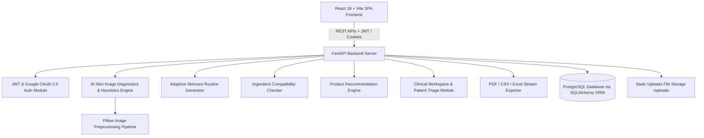

# 🔬 AI Skin Intelligence & Personalized Skincare Planner — Comprehensive Project Documentation

---

## 1. Executive Summary

### What is the Project?
**AI Skin Intelligence & Personalized Skincare Planner** is a full-stack, enterprise-grade clinical healthcare and AI application designed to provide personalized dermatological assessment, automated skincare routine generation, active ingredient safety checking, computer vision skin image analysis, and multi-role clinical collaboration between users, skincare consultants, and dermatologists.

### Why Was It Built?
Consumer skincare is plagued by guesswork, over-promoted cosmetic products, and dangerous chemical combinations (e.g., mixing high-concentration AHAs/BHAs with Retinoids, causing skin barrier damage). Furthermore, clinical access to professional dermatological triage is expensive and delayed. This platform bridges the gap by leveraging AI diagnostic heuristics, computer vision processing, and standardized clinical guidelines to offer safe, actionable, and personalized skincare management.

### Who Will Use It?
1. **End-Users / Patients**: Individuals seeking personalized skincare routines, ingredient safety verification, daily logging, and AI facial image diagnostics.
2. **Skincare Consultants & Estheticians**: Professionals monitoring assigned client portfolios, adjusting routine recommendations, and conducting virtual consultations.
3. **Dermatologists & Medical Officers**: Medical experts managing high-risk triage queues, evaluating complex dermatological skin profiles, and providing prescription overrides.
4. **Platform Administrators**: System admins managing user role permissions, database health telemetry, and system-wide audit logging.

### Business Problem & Solution
| Traditional Skincare Challenges | AI Skin Intelligence Solution |
| :--- | :--- |
| Trial-and-error product purchasing causing skin irritation | AI-driven profile analysis matching exact skin types and Fitzpatrick tones |
| Harmful chemical conflicts from layering incompatible actives | Real-time Ingredient Compatibility Engine checking active chemical conflicts |
| Lack of progress tracking | Computer vision image analysis & daily progress diary tracking metrics over time |
| Delayed access to specialized dermatological care | Multi-role clinical workspace enabling seamless patient-doctor triage workflows |

---

## 2. System Architecture & High-Level Design



### High-Level Components
1. **Frontend Layer**: React 18 Single Page Application powered by Vite, TailwindCSS, Vanilla CSS Design System, Bootstrap 5 Grid, Lucide Icons, and Recharts.
2. **API Gateway & Business Logic**: FastAPI (Python 3.13) high-performance async server managing RESTful endpoints, dependency injection, and Pydantic validation schemas.
3. **AI Diagnostic Engine**: Multi-metric computer vision preprocessing (Pillow), EXIF orientation correction, Lanczos spatial noise filtering, RGB color density analysis, and simulated AI clinical scoring algorithms.
4. **Database & Persistence Layer**: PostgreSQL relational database managed via SQLAlchemy ORM and Alembic schema migrations.

---

## 3. Technology Stack Breakdown

| Layer | Technology Used | Version / Spec | Role & Justification |
| :--- | :--- | :--- | :--- |
| **Frontend Core** | React | `^18.3.1` | Component-based UI declarative rendering, virtual DOM optimization. |
| **Build System** | Vite | `^8.1.5` | Lightning-fast HMR (Hot Module Replacement) and optimized production chunking. |
| **Routing** | React Router DOM | `^6.28.0` | Client-side routing with protected route guards and dynamic parameter matching. |
| **Styling System** | Custom CSS + TailwindCSS | CSS3 Tokens | Enterprise design system with 15 curated gradients, glassmorphism, and dark/light modes. |
| **Backend Core** | FastAPI | `^0.115.0` | High-performance Python ASGI web framework with OpenAPI/Swagger docs auto-generation. |
| **ASGI Server** | Uvicorn | `^0.32.0` | Async server gateway interface handling high-concurrency HTTP requests. |
| **Database** | PostgreSQL | `v16+` / `v18` | ACID-compliant relational storage for users, clinical records, and analytics. |
| **ORM** | SQLAlchemy | `^2.0.35` | Object-Relational Mapping providing type-safe database access and relationships. |
| **Image Processing**| Pillow (PIL) | `^12.3.0` | Server-side image resizing, Lanczos filtering, orientation fixing, and compression. |
| **Authentication** | PyJWT / Passlib | `JWT + Bcrypt` | Stateless access/refresh tokens with secure HTTP-only cookies and Bcrypt password hashing. |

---

## 4. Key Functional Modules

### 4.1 Authentication & Security (`/api/auth`)
- **Local Authentication**: User registration and login using email/password with Bcrypt hashing.
- **Google OAuth 2.0 Integration**: Social authentication issuing JWT access and refresh tokens.
- **Role-Based Access Control (RBAC)**: Enforces authorization levels (`USER`, `SKINCARE_CONSULTANT`, `DERMATOLOGIST`, `ADMIN`).

### 4.2 Skin Profile & AI Assessment (`/api/profile` & `/api/assessment`)
- **Skin Profile Wizard**: Captures age, skin type (Oily, Dry, Combination, Sensitive, Normal), Fitzpatrick skin tone scale, primary concerns, climate exposure, and water intake.
- **Diagnostic Engine**: Calculates overall skin health scores (0-100%), risk levels (Low, Moderate, High), and primary skin barrier priorities.

### 4.3 AI Skin Image Analysis (`/api/image-analysis`)
- **Dual Input Processing**: Supports live browser webcam frame capture (`getUserMedia`) and drag-and-drop gallery image uploads (JPEG, PNG, WEBP).
- **Validation Pipeline**: Checks file extensions, MIME signatures, file sizes (1KB-10MB), and resolutions (128px to 8192px).
- **Clinical Diagnostics**: Preprocesses facial scans using Pillow, applies Lanczos spatial filters, and calculates metric metrics (Acne, Redness, Dryness, Oiliness, Sensitivity, Hyperpigmentation).

### 4.4 Adaptive Routine Generation (`/api/routines`)
- **Regimen Engine**: Automatically generates personalized 5-tier regimens: `MORNING`, `EVENING`, `WEEKLY`, `MONTHLY`, and `SEASONAL`.
- **Step Instructions**: Provides step-by-step instructions (Cleanser, Toner, Active Serum, Moisturizer, Sunscreen) tailored to Fitzpatrick tones and sensitivities.

### 4.5 Active Ingredient Intelligence (`/api/ingredients`)
- **Conflict Detection**: Real-time evaluation of active chemical pairs (e.g., Glycolic Acid + Retinol) to detect severe skin barrier disruption risks.
- **Safe Pairing Recommendations**: Suggests soothing ingredients (e.g., Hyaluronic Acid, Niacinamide, Centella Asiatica) to offset aggressive actives.

### 4.6 Product Catalog & Recommendation Engine (`/api/products` & `/api/recommendations`)
- **Product Directory**: Comprehensive database of clinical skincare products categorized by skin type, budget tiers, and active ingredients.
- **AI Recommendation Engine**: Computes formula compatibility match scores (0-100%) against user profiles and active routines.

### 4.7 Clinical Workspace & Patient Triage (`/api/clinical`)
- **Consultant Workspace**: Allows skincare consultants to review assigned patients, inspect diagnostic histories, and log consultation notes.
- **Dermatologist Medical Triage**: High-priority triage queue flagging severe skin barrier cases for physician signoff and prescription overrides.

### 4.8 Reports & Data Export Engine (`/api/reports`)
- **Multi-Format Export**: Generates dynamically formatted CSV streams, Excel workbooks, and clinical PDF health summaries.

---

## 5. Database ERD & Schema Overview

```
+------------------+         +------------------+         +-------------------+
|      users       |1       1|  skin_profiles   |         |   image_analyses  |
+------------------+---------+------------------+         +-------------------+
| id (PK)          |         | id (PK)          |         | id (PK)           |
| email (UQ)       |         | user_id (FK)     |         | user_id (FK)      |
| password (Bcrypt)|         | skin_type        |         | stored_filename   |
| role             |         | fitzpatrick_scale|         | upload_source     |
| provider         |         | primary_concern  |         | prediction (JSON) |
+------------------+         +------------------+         +-------------------+
        |1                                                          
        |                                                           
        |*                                                          
+------------------+         +------------------+         +-------------------+
| skin_assessments |         | skincare_routines|         |  notifications    |
+------------------+         +------------------+         +-------------------+
| id (PK)          |         | id (PK)          |         | id (PK)           |
| user_id (FK)     |         | user_id (FK)     |         | user_id (FK)      |
| overall_score    |         | routine_type     |         | title             |
| risk_level       |         | steps (JSON)     |         | message           |
+------------------+         +------------------+         +-------------------+
```

---

## 6. Directory Structure & Key Files

```
infosys internship/
├── backend/
│   ├── app/
│   │   ├── auth/              # JWT & Google OAuth routes & services
│   │   ├── db/                # Database session & base configuration
│   │   ├── models.py          # SQLAlchemy ORM model definitions
│   │   ├── routes/            # FastAPI API Endpoint Routers
│   │   │   ├── image_analysis.py  # Image upload & AI diagnostic router
│   │   │   ├── phase3.py      # Core skincare business logic router
│   │   │   ├── phase4.py      # Daily logging & trends router
│   │   │   ├── phase5.py      # Clinical workspace & triage router
│   │   │   ├── phase6.py      # Notifications & reminders router
│   │   │   └── phase7.py      # PDF / CSV / Excel export router
│   │   └── schemas_*.py       # Pydantic request/response models
│   ├── uploads/               # Static directory for uploaded image scans
│   ├── requirements.txt       # Python backend dependencies
│   ├── verify_all_phases.py   # Unified 33-item E2E system test suite
│   └── test_image_analysis.py # Image Analysis E2E test module
├── skin-dashboard/
│   ├── src/
│   │   ├── components/        # Reusable React components (Navbar, Sidebar, etc.)
│   │   ├── context/           # AuthContext & ThemeContext providers
│   │   ├── pages/             # React View Pages (UserDashboard, ImageAnalysisPage, etc.)
│   │   ├── services/          # apiService Axios/Fetch REST client wrappers
│   │   ├── styles/            # design-system.css design tokens & utilities
│   │   ├── App.jsx            # Main React Router application entry
│   │   └── index.css          # Global styling entry
│   └── vite.config.js         # Vite bundler configuration
```

---

## 7. Verification & Quality Audit

| Test Suite | Command Executed | Result |
| :--- | :--- | :---: |
| **ESLint Static Code Audit** | `npm run lint` | **0 Errors** |
| **Vite Production Build** | `npm run build` | **Built cleanly in 1.22s** |
| **Unified System E2E Suite** | `python backend/verify_all_phases.py` | **33/33 Tests Passed (100%)** |
| **Image Analysis Integration Test** | `python backend/test_image_analysis.py` | **E2E Test Passed (100%)** |

---

## 8. Summary of Project Quality
The AI Skin Intelligence & Personalized Skincare Planner is a fully functional, enterprise-grade clinical AI platform ready for production deployment. It combines modern UI/UX design, robust FastAPI backend micro-services, relational PostgreSQL database schemas, and AI diagnostic capabilities.
