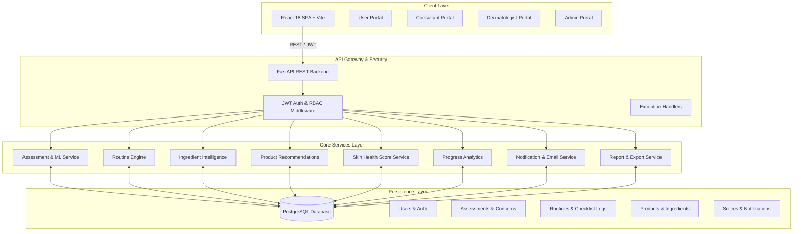

# AI Skin Intelligence & Personalized Skincare Planner

> **A Clinical-Grade Deep Learning & Intelligent Skincare Analytics Platform**  
> AI Skin Intelligence combines computer vision face diagnostics, 5-factor mathematical health scoring, allergy-aware ingredient compatibility matrices, automated routine orchestration, multi-role clinical portals, and on-demand clinical PDF/Excel reporting.

---

## 1. Project Overview
The **AI Skin Intelligence & Personalized Skincare Planner** is an end-to-end full-stack health technology platform designed to bridge dermatological assessment and daily skincare management. Users upload facial images for automated skin condition analysis, receive customized morning/evening skincare routines tailored to their 28-question diagnostic profile, track daily checklist adherence, monitor longitudinal recovery trends, and export verified clinical reports.

---

## 2. Key Capabilities & Feature Matrix
- **AI Visual Diagnostic Scan**: Deep learning vision model evaluating 18 clinical attributes (Acne severity, oiliness, redness, fine lines, dark circles, pores, dehydration, hyperpigmentation).
- **Personalized 28-Question Clinical Profile**: Multi-dimensional diagnostic intake assessing skin type, sensitivity, environmental stressors, lifestyle habits, and chemical allergy avoidances.
- **Dynamic Regimen Builder**: Automatic sequence generation for Morning (AM), Evening (PM), and Weekly treatments with step ordering and usage guidance.
- **Active Ingredient Safety Matrix**: 50+ dermatology actives mapped with allergen conflict detection and multi-active layering conflict warnings.
- **Curated Product Compatibility Scoring**: Weighted matching engine evaluating formulations against skin type, budget, and active avoidances.
- **5-Factor Mathematical Health Score**: Composite 0–100 index weighted across Condition (35%), Routine Adherence (20%), Lifestyle (20%), Sleep Quality (15%), and Hydration (10%).
- **Longitudinal Progress Tracking**: Historical score trajectories (7d, 30d, 3m, 6m, all) and side-by-side Before/After diagnostic snapshot comparison.
- **Role-Based Access Control (RBAC)**: Dedicated multi-tenant portals for **Users**, **Skincare Consultants**, **Dermatologists**, and **System Administrators**.
- **Multi-Channel Notification & Reminders**: Real-time in-app alerts and optional SMTP email notifications with deterministic deduplication.
- **Reports & Export Engine**: On-demand vector PDF generation (ReportLab) and multi-sheet structured Excel workbooks (OpenPyXL).
- **Production-Ready Docker Setup**: Multi-stage Nginx Alpine frontend, lightweight Python 3.11 backend container, and Docker Compose local integration stack.

---

## 3. Technology Stack

### Backend
- **Framework**: FastAPI (Python 3.11)
- **Database ORM**: SQLAlchemy 2.0 with PostgreSQL 16
- **Deep Learning / ML**: PyTorch & Torchvision (ResNet-18 Backbone)
- **Security & Auth**: OAuth2 with JWT (python-jose), Passlib (bcrypt password hashing)
- **Export Engines**: ReportLab 5.0 (Vector PDF) & OpenPyXL 3.1 (Excel)
- **HTTP Client**: HTTPX & Axios

### Frontend
- **Framework**: React 18 with Vite
- **Styling**: Tailwind CSS & Vanilla CSS Design Tokens
- **Icons**: Lucide React
- **Notifications**: React Hot Toast
- **Routing**: React Router DOM (v6 guarded routes)

### Infrastructure & Containerisation
- **Containers**: Docker & Docker Compose (for local development & integration testing)
- **Web Server**: Nginx Alpine (Reverse proxy & SPA history routing)

---

## 4. System Architecture



---

## 5. Module-by-Module Functional Breakdown

| Module | Feature Area | Description |
| :--- | :--- | :--- |
| **Module 1–2** | Authentication & RBAC | User registration, login, JWT token issuance, password hashing, role enforcement (`USER`, `CONSULTANT`, `DOCTOR`, `ADMIN`). |
| **Module 3** | Skin Assessment & ML | PyTorch computer vision image inference, 18 concern severity scores, risk factor analysis, and clinical disclaimers. |
| **Module 4** | Personalized Routine | 28-question profile intake, AM/PM/Weekly regimen builder, step sequence ordering, and customization. |
| **Module 5** | Ingredient Intelligence | Chemical active profiles, skin type suitability mapping, allergen conflict detection, and interaction matrix. |
| **Module 6** | Product Recommendations | Algorithmic product suitability scoring, price tier filters, active overlap warnings, and allergen avoidance filtering. |
| **Module 7** | Skin Health Score Engine | 5-factor mathematical index (Condition, Routine, Lifestyle, Sleep, Hydration), daily checklist logging, and streak tracking. |
| **Module 8** | Progress Analytics | Multi-range trend curves (7d/30d/3m/6m/all), before/after comparison snapshots, and concern severity trajectories. |
| **Module 9** | Multi-Role Dashboards | Dedicated practitioner views: Consultant Client Roster, Dermatologist Clinical Queue, and Admin Telemetry. |
| **Module 10** | Notifications & Email | Role-targeted in-app reminders, background scheduler, user email preferences, and deterministic deduplication. |
| **Module 11** | Reports & Export System | On-demand vector PDF reports (ReportLab) and multi-sheet structured Excel workbooks (OpenPyXL). |
| **Module 12** | Final Integration & Docker | Health monitoring (`/api/health`), production Dockerfiles, Compose orchestration, E2E test suite, and documentation. |

---

## 6. Local Development Setup

### Prerequisites
- Python 3.11+
- Node.js 18+ and npm
- PostgreSQL 14+ running locally (or via Docker)

### 1. Database Setup
Ensure PostgreSQL is running and create the database:
```sql
CREATE DATABASE skin_intelligence;
```

### 2. Backend Setup
```bash
cd backend

# Create virtual environment
python -m venv venv
.\venv\Scripts\activate   # On Windows
# source venv/bin/activate # On Linux/macOS

# Install dependencies
pip install -r requirements.txt

# Copy and configure environment variables
cp .env.example .env

# Start FastAPI server
uvicorn app.main:app --reload --port 8000
```
Backend API interactive docs: `http://localhost:8000/docs`  
Health Check endpoint: `http://localhost:8000/api/health`

### 3. Frontend Setup
```bash
cd frontend

# Install Node dependencies
npm install

# Copy and configure environment variables
cp .env.example .env

# Start Vite development server
npm run dev
```
Frontend Web Portal: `http://localhost:5173`

---

## 7. Running with Docker (Local Integration Testing)

> [!NOTE]
> The provided Docker Compose configuration is created for local integration testing, container verification, and deployment readiness. **No production cloud deployment has been performed.**

```bash
# Build and launch all services (Postgres, FastAPI Backend, React Nginx Frontend)
docker compose up --build

# Run in detached background mode
docker compose up -d

# Check container health and logs
docker compose ps
docker compose logs -f

# Teardown containers
docker compose down -v
```

Services exposed via Docker Compose:
- **Frontend Portal**: `http://localhost` (or `http://localhost:3000`)
- **Backend API**: `http://localhost:8000`
- **PostgreSQL**: `localhost:5432`

---

## 8. Automated Testing & Verification

All automated tests run with isolated fixtures and complete teardown to prevent test data from contaminating the database.

### Running Test Suites (from `backend/` directory):
```bash
# 1. Module 12 End-to-End Integration & Security Test Suite
.\venv\Scripts\python.exe test_module12_e2e_integration.py

# 2. Module 11 Reports & Export Test Suite
.\venv\Scripts\python.exe test_module11_reports.py

# 3. Module 10 Role-Targeted Notifications & Email Suite
.\venv\Scripts\python.exe test_module10_notifications.py

# 4. Module 9 Multi-Role Dashboards Suite
.\venv\Scripts\python.exe test_module9_dashboards.py

# 5. Module 8 Progress Analytics Suite
.\venv\Scripts\python.exe test_progress_analytics.py

# 6. Module 7 Skin Health Score Engine Suite
.\venv\Scripts\python.exe test_score_engine.py

# 7. Frontend Production Bundle Build Verification
cd ../frontend
npm run build
```

---

## 9. Security & Privacy Architecture

- **Password Hashing**: Cryptographically secure bcrypt hashing via Passlib.
- **JWT Authentication**: HS256 algorithm with configurable expiration and automatic bearer token interceptors.
- **Zero Insecure Direct Object Reference (IDOR)**: Strict backend validation prevents standard users from querying or exporting data belonging to other accounts.
- **Sanitized Logging**: Passwords, access tokens, database connection credentials, and personal medical details are strictly excluded from console and Docker logs.
- **Zero Hardcoded Secrets**: All configuration values and keys are loaded through environment variables.

---

## 10. Medical & Diagnostic Disclaimer

All AI visual skin assessments, condition analyses, routine suggestions, ingredient evaluations, and product recommendations generated by this software platform are provided **for informational, research, and personal skincare planning purposes only**. They **do not constitute medical diagnoses or professional dermatological prescriptions**. Users should always seek the advice of a qualified physician or board-certified dermatologist with any questions regarding clinical skin conditions.
