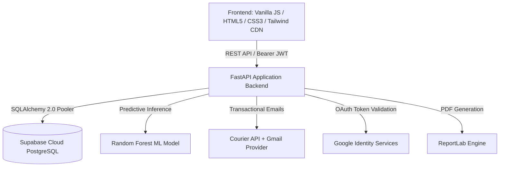

# 🌿 AI Skin Intelligence & Personalized Skincare Planner

[](https://fastapi.tiangolo.com)
[](https://www.python.org/)
[](https://supabase.com)
[](https://scikit-learn.org/)
[](https://developers.google.com/identity)
[](https://www.courier.com/)
[](LICENSE)

An enterprise-grade, multi-portal AI-driven skincare intelligence platform. **AI Skin Intelligence & Personalized Skincare Planner** combines predictive machine learning models, deterministic dermatological scoring engines, active ingredient compatibility checks, product recommendations, and clinical collaboration workflows across four distinct user roles: **Users (Patients)**, **Dermatologists**, **Skincare Consultants**, and **System Administrators**.

Production Link : skinai.ondevice.shop
---

## 📑 Table of Contents

- [Core Features](#-core-features)
- [System Architecture & Tech Stack](#-system-architecture--tech-stack)
- [Project Directory Structure](#-project-directory-structure)
- [Prerequisites](#-prerequisites)
- [Installation & Quick Start](#-installation--quick-start)
- [Environment Configuration (`.env`)](#-environment-configuration-env)
- [Database Setup & Migrations](#-database-setup--migrations)
- [Application User Guide](#-application-user-guide)
  - [1. Account Registration & Role Selection](#1-account-registration--role-selection)
  - [2. User (Patient) Portal](#2-user-patient-portal)
  - [3. Dermatologist Portal](#3-dermatologist-portal)
  - [4. Skincare Consultant Portal](#4-skincare-consultant-portal)
  - [5. Administrator Portal](#5-administrator-portal)
- [Machine Learning & Algorithmic Engines](#-machine-learning--algorithmic-engines)
- [Automated Notifications & Reminders](#-automated-notifications--reminders)
- [API Documentation & Interactive Docs](#-api-documentation--interactive-docs)
- [Testing & Verification](#-testing--verification)
- [Troubleshooting & FAQs](#-troubleshooting--faqs)
- [License](#-license)

---

## ✨ Core Features

### 1. 🔬 AI Skin Health Assessment & Scoring Engine
- **Composite Skin Health Score (0–100)**: Calculated using a deterministic weighted scoring model combined with a trained Random Forest Regressor (`skin_health_score_model.pkl`):
  - Skin Condition Assessment (35%)
  - Routine Consistency (20%)
  - Lifestyle Habits (20%)
  - Sleep Quality (15%)
  - Hydration Level (10%)
- **Dynamic Categorization**: Classifies skin health into *Excellent*, *Good*, *Fair*, or *Poor*.
- **Risk Detection Engine**: Pinpoints barrier impairment, dehydration, sun sensitivity, and hormonal or environmental stressors.
- **Priority Concern Ranking**: Identifies primary and secondary concerns (e.g., Active Acne, Hyperpigmentation, Fine Lines, Dullness) and ranks them by urgency and severity.

### 2. ☀️ Personalized AM/PM & Seasonal Routine Planner
- **Intelligent Regimen Generation**: Builds custom morning and evening skincare routines tailored to skin type, active concerns, sensitivities, and allergies.
- **Dynamic Seasonal Adaptation**: Automatically shifts recommendations across **Summer**, **Autumn**, **Winter**, and **Spring** (e.g., lightweight gel hydration & enhanced SPF in summer, rich ceramides & gentle lipids in winter).
- **Interactive Step Management**: Add custom steps, reorder, toggle completion, and view active ingredient caution notes.
- **Allergy & Contraindication Safeguards**: Filters out allergens and sensitive triggers specified in the user's profile.

### 3. 🧪 Ingredient Intelligence & Formulation Safety
- **Formulation Compatibility Checker**: Analyzes ingredient interactions and alerts users to clashes (e.g., *Retinoids + AHA/BHA exfoliants*, *Benzoyl Peroxide + Pure L-Ascorbic Acid*).
- **Interactive Conflict Matrix**: Visual reference guide illustrating synergies, caution flags, and severe contraindications.
- **Ingredient Education Guide**: Comprehensive monographs detailing mechanism of action, optimal pH, ideal pairings, and skin type suitability for key actives (Niacinamide, Retinoids, Hyaluronic Acid, Azelaic Acid, Salicylic Acid, Vitamin C, Ceramides, Centella Asiatica, etc.).

### 4. 🛍️ Product Catalog & Suitability Engine
- **Curated Skincare Database**: High-efficacy cleansers, toners, serums, exfoliants, moisturizers, and sunscreens.
- **Suitability Match Percentage**: Calculates compatibility percentage against the user's skin profile.
- **Side-by-Side Product Comparison**: Compare formulation, active ingredient concentrations, price, pros, and cons.
- **Budget-Optimized Routine Generator**: Assembles a complete morning-to-night routine within custom budget constraints (e.g., Under $50, Under $100).

### 5. 📅 Daily Habit Tracker & Longitudinal Analytics
- **AM & PM Daily Check-ins**: Interactive daily completion logger calculating routine compliance streaks and consistency scores.
- **Longitudinal Trend Graphs**: Visual representation of skin health score trajectory over time.
- **Before & After Photo Comparison**: Interactive slider comparing baseline and follow-up progress images.
- **Multi-Format Export**: Instant export of skin assessments, routines, and clinical notes to **PDF**, **CSV**, or **JSON** via ReportLab.

### 6. 🩺 Multi-Role Collaborative Ecosystem
- **User Portal**: End-to-end self-service skincare management.
- **Dermatologist Portal**: Clinical diagnostics, patient assessment review, prescription active assignment, urgency tagging, and clinical treatment plans.
- **Consultant Portal**: Routine curation, client review, and lifestyle coaching.
- **Admin Portal**: Credential verification, practitioner approvals, client allocations, platform audit logs, and global analytics.

---

## 🏗️ System Architecture & Tech Stack



| Layer | Technologies |
| :--- | :--- |
| **Backend Framework** | [FastAPI](https://fastapi.tiangolo.com/) (Python 3.10+), [Uvicorn](https://www.uvicorn.org/) ASGI Server |
| **Database & ORM** | [Supabase](https://supabase.com/) Cloud PostgreSQL, [SQLAlchemy 2.0](https://www.sqlalchemy.org/), [psycopg2-binary](https://www.psycopg.org/) |
| **Machine Learning** | [Scikit-Learn](https://scikit-learn.org/), [Pandas](https://pandas.pydata.org/), [Joblib](https://joblib.readthedocs.io/), [OpenPyXL](https://openpyxl.readthedocs.io/) |
| **Security & Auth** | JWT (`python-jose`), Passlib (Bcrypt), Google OAuth 2.0 (`google-auth`) |
| **Email & Notifications**| [Courier REST API](https://www.courier.com/) with Gmail Channel Integration |
| **Document Generation** | [ReportLab](https://www.reportlab.com/) (Vector PDF), Pandas (CSV/JSON) |
| **Frontend UI** | Semantic HTML5, Vanilla JavaScript (ES6+), CSS3 Variables, Tailwind CSS (Utility CDN) |

---

## 📁 Project Directory Structure

```text
├── main.py                     # Primary ASGI server entry point
├── requirements.txt            # Python package dependencies
├── .env.example                # Sample environment variables template
├── LICENSE                     # MIT License
├── uploads/                    # User uploaded skin progress photos
│
├── app/                        # Application core package
│   ├── main.py                 # FastAPI application routes, auth, endpoints
│   ├── database.py             # Supabase PostgreSQL engine & connection pooler
│   ├── db_sync.py              # Automatic database schema synchronizer
│   ├── models.py               # SQLAlchemy ORM relational models
│   └── services/               # Modular business logic engines
│       ├── analytics_engine.py             # Trends, improvements, photo comparisons
│       ├── courier_service.py              # Courier API email dispatch & status tracking
│       ├── ingredient_intelligence.py      # Conflicts, compatibility, ingredient monographs
│       ├── notification_service.py         # Multi-channel notification routing
│       ├── product_engine.py               # Product catalog, suitability & budget routines
│       ├── reminder_performance_engine.py  # Background worker for adherence nudges
│       ├── report_service.py               # ReportLab PDF & tabular report builders
│       └── routine_engine.py              # Dynamic routine generation & seasonal logic
│
├── ML_models/                  # Machine learning models and training scripts
│   ├── scoring_engine.py                   # Deterministic 5-factor weighted scoring algorithm
│   ├── risk_engine.py                      # Clinical risk detection logic
│   ├── priority_concern.py                 # Concern severity ranking engine
│   ├── retrain_model.py                    # Pipeline to train Random Forest from dataset
│   ├── skin_health_score_model.pkl         # Trained Random Forest Regressor pipeline
│   └── Skin_Assessment_Training_Dataset.xlsx # Assessment training dataset
│
├── Frontend/                   # Client-side web portals
│   ├── index.html              # Multi-role Login & Google Sign-In
│   ├── register.html           # Account registration portal
│   ├── styles.css              # Global styles & brand aesthetics
│   ├── script.js               # Auth handling & role-based routing
│   ├── user/                   # User / Patient Dashboard
│   │   ├── user.html           # 9-section user application view
│   │   ├── user.css            # User portal styling
│   │   └── user.js             # User portal logic & API bindings
│   ├── dermatologist/          # Clinical Dermatologist Portal
│   │   ├── dermatologist.html  # Patient list, diagnostic tools, prescriptions
│   │   ├── dermatologist.css   # Clinical portal theme
│   │   └── dermatologist.js    # Dermatologist API workflows
│   ├── consultant/             # Skincare Consultant Portal
│   │   ├── consultant.html     # Client directory, routine reviews
│   │   ├── consultant.css      # Consultant styling
│   │   └── consultant.js       # Consultant client management
│   └── admin/                  # Administrative Portal
│       ├── admin.html          # Practitioner approval, assignments, analytics
│       ├── admin.css           # Admin styling
│       └── admin.js            # Admin management logic
│
├── scripts/                    # Automation and testing utilities
│   └── manual_courier_test.py  # Safe Courier email verification script
│
└── tests/                      # Automated test suite
    └── test_courier_service.py # Unit tests for notification & Courier service
```

---

## ⚙️ Prerequisites

Before getting started, ensure you have the following installed on your system:
- **Python 3.10+** (Python 3.10, 3.11, or 3.12 recommended)
- **Git**
- A **Supabase** account (Free tier works seamlessly) or any PostgreSQL database
- *(Optional)* A **Courier** account for real-world email delivery
- *(Optional)* A **Google Cloud Console** Client ID for Google Sign-In

---

## 🚀 Installation & Quick Start

### Step 1: Clone the Repository
```bash
git clone https://github.com/springboardmentor23232a-eng/AI_Skin-Intelligence-Personalized-Skincare-Planner.git
cd AI_Skin-Intelligence-Personalized-Skincare-Planner
```

### Step 2: Create and Activate a Virtual Environment
- **On Windows (PowerShell):**
  ```powershell
  python -m venv venv
  .\venv\Scripts\Activate.ps1
  ```
- **On Linux / macOS:**
  ```bash
  python3 -m venv venv
  source venv/bin/activate
  ```

### Step 3: Install Required Dependencies
```bash
pip install --upgrade pip
pip install -r requirements.txt
```

### Step 4: Configure Environment Variables
Copy the `.env.example` file to `.env`:
- **Windows:**
  ```powershell
  copy .env.example .env
  ```
- **Linux / macOS:**
  ```bash
  cp .env.example .env
  ```
Open `.env` in your text editor and fill in your credentials (see [Environment Configuration](#-environment-configuration-env)).

### Step 5: Initialize and Start the Server
Run the root application script:
```bash
python main.py
```
*Alternatively, you can run directly using Uvicorn with hot-reload:*
```bash
uvicorn app.main:app --host 0.0.0.0 --port 8000 --reload
```

### Step 6: Access the Application
Once the server starts, open your browser and navigate to:
- **Landing / Login Page**: `http://localhost:8000/`
- **Registration Page**: `http://localhost:8000/register.html`
- **Interactive Swagger API Docs**: `http://localhost:8000/docs`
- **Alternative ReDoc API Docs**: `http://localhost:8000/redoc`

---

## 🔐 Environment Configuration (`.env`)

Configure your `.env` file with the following variables:

```env
# ===========================================================================
# 1. Database Configuration (Supabase Cloud PostgreSQL)
# ===========================================================================
# Your Supabase Project URL (e.g., https://xyzcompany.supabase.co)
SUPABASE_URL=https://your-project-ref.supabase.co

# Your Supabase Anon Public API Key
SUPABASE_ANON_KEY=eyJhbGciOi...your_anon_key_here

# Your Supabase Database Password (set when creating your Supabase project)
SUPABASE_DB_PASSWORD=your_strong_db_password

# (Optional IPv4 Pooler Host: Recommended on networks with IPv6 latency)
# Example: aws-0-ap-southeast-1.pooler.supabase.com
SUPABASE_DB_HOST=

# ===========================================================================
# 2. Initial Administrator Account (Seeded on first startup)
# ===========================================================================
ADMIN_EMAIL=admin@skincareai.com
ADMIN_PASSWORD=AdminSecurePassword123!

# ===========================================================================
# 3. Security & Authentication
# ===========================================================================
# A strong, random 32+ character secret string used to sign JWT tokens
SECRET_KEY=your_super_secret_jwt_encryption_key_min_32_chars

# Google OAuth 2.0 Web Client ID (from Google Cloud Console)
GOOGLE_CLIENT_ID=your_google_client_id.apps.googleusercontent.com

# ===========================================================================
# 4. Email Notification Delivery (Courier API)
# ===========================================================================
# Your Courier API Key (from Courier Dashboard -> Settings -> API Keys)
COURIER_API_KEY=replace_with_your_courier_api_key

# Port to bind server to (Default: 8000)
PORT=8000
```

> [!IMPORTANT]
> - `SECRET_KEY` is **mandatory**. If left blank, the application will raise an error on startup to safeguard token security.
> - Password rules enforced during registration: minimum **8 characters**, at least **one uppercase letter**, **one lowercase letter**, and **one numeric digit**.

---

## 🗄️ Database Setup & Migrations

The application manages PostgreSQL database schemas automatically:
1. When the server launches, `Base.metadata.create_all(bind=engine)` verifies and creates all relational tables.
2. `app/db_sync.py` automatically runs schema enhancements to add missing columns (e.g., `first_name`, `last_name`, `phone_number`, push notification preferences, `courier_request_id`) and backfills existing user profiles safely.
3. You can also manually trigger a schema sync at any time:
   ```bash
   python -m app.db_sync
   ```

---

## 📖 Application User Guide

### 1. Account Registration & Role Selection

The application supports four distinct roles:

```text
               ┌───────────────┐
               │ Register / UI │
               └───────┬───────┘
                       │
       ┌───────────────┼───────────────┐
       ▼               ▼               ▼
   👤 User        🩺 Derm         🧖‍♀️ Consultant
(Active right   (Status:         (Status:
  away)          Pending)         Pending)
                       │               │
                       └───────┬───────┘
                               ▼
                        🛡️ Admin Portal
                     (Review Credentials &
                      Approve Account)
```

1. Navigate to `http://localhost:8000/register.html`.
2. Select your desired role:
   - **User**: Immediate self-service account.
   - **Consultant**: Requires verification of skincare qualifications.
   - **Dermatologist**: Requires verification of medical license and clinical specialization.
3. Enter your **Full Name**, **Email**, and a secure **Password**.
4. Click **Register Account**.

> [!NOTE]
> **Practitioner Approval Workflow**: To uphold clinical safety standards, newly registered **Dermatologists** and **Consultants** are placed in a `pending` status. An Administrator must log in to the Admin Portal and click **Approve** before practitioners can log in to their respective dashboards.

---

### 2. User (Patient) Portal
**URL**: `http://localhost:8000/user/user.html`

The User Portal contains 9 core sections:

#### Step 1: Complete Skin Assessment (`#profile`)
- Enter your **Skin Type** (*Normal, Dry, Oily, Combination, Sensitive*).
- Select active **Skin Concerns** (*Acne, Hyperpigmentation, Aging, Redness, Dullness, Large Pores*).
- Document **Sensitivities**, **Allergies**, **Sleep Quality**, **Water Intake**, and **Environmental Exposure** (UV, Urban Pollution).
- *(Optional)* Upload a clear facial photo for clinical record keeping.
- Click **Save Skin Profile**.

#### Step 2: View Skin Health Score & Risk Analysis (`#score`)
- View your **Overall Skin Health Score** (0–100) and classification (*Excellent, Good, Fair, Poor*).
- Inspect the **5-Factor Breakdown**: Condition (35%), Consistency (20%), Lifestyle (20%), Sleep (15%), Hydration (10%).
- Review the **Risk Analysis** card explaining potential hazards (e.g., impaired barrier function, photo-damage risk).
- Review **Priority Concerns** ranked by severity.

#### Step 3: Follow Personalized AM/PM Routines (`#routine`)
- Switch between **☀️ Morning Routine**, **🌙 Evening Routine**, **🗓️ Weekly Plan**, and **🌿 Seasonal Advice**.
- Each step displays:
  - Step order and category badge (🧼 Cleansing, ✨ Exfoliation, 💧 Treatment, 🧴 Moisturizing, ☀️ Sun Protection, 🌙 Night Care).
  - Recommended active ingredients and directions for use.
  - Caution and safety notes.
- Use **Add Step** to insert custom products or **Regenerate Routine** to recompute steps based on updated seasonal factors.

#### Step 4: Daily Routine Check-ins (`#checklist`)
- Click **Complete Morning Routine** and **Complete Evening Routine** each day.
- Builds your consistency streak and feeds real-time compliance data into your Skin Health Score.

#### Step 5: Ingredient Intelligence (`#ingredients`)
- **Compatibility Checker**: Type two or more active ingredients (e.g., `Retinol`, `Glycolic Acid`) to evaluate potential irritation or chemical conflict.
- **Conflict Matrix**: View pre-compiled safety pairs and contraindications.
- **Active Directory**: Learn about safe concentrations, application order, and optimal skin targets.

#### Step 6: Product Recommendations & Comparison (`#recommendations`)
- Browse curated products filtered by category.
- Check the **Suitability Score** calculated for your profile.
- Select two products to view a **Side-by-Side Comparison**.
- Use the **Budget Optimizer** to generate an affordable full routine tailored to your budget cap.

#### Step 7: Progress Analytics & Photo Comparisons (`#progress`)
- Track score improvements over 30, 60, and 90 days.
- Upload periodic follow-up photos.
- Use the interactive **Before / After Comparison Slider** to visually inspect skin improvements.

#### Step 8: Export Reports (`#reports`)
- Download professional reports in **PDF**, **CSV**, or **JSON** format:
  - *Full Skin Assessment Summary*
  - *Current AM/PM Routine Plan*
  - *Product Recommendations Dossier*
  - *Progress & Improvement Log*

---

### 3. Dermatologist Portal
**URL**: `http://localhost:8000/dermatologist/dermatologist.html`

Designed for licensed medical practitioners to oversee patients:
1. **Patient Directory (`#patients`)**:
   - View assigned patients, their recent skin scores, and risk flags.
   - Access comprehensive patient profiles, historical logs, and uploaded clinical photos.
2. **Clinical Condition Analysis (`#condition-reports`)**:
   - Review AI risk detections and prioritized concerns.
   - Inspect self-reported symptoms, allergies, and lifestyle factors.
3. **Prescribe Treatments (`#treatments`)**:
   - Issue clinical recommendations with **Diagnosis Title**, **Treatment Plan**, **Prescribed Actives / Medications**, and **Urgency Level** (*Routine, Priority, Urgent*).
   - Once submitted, recommendations are automatically visible on the patient's dashboard and dispatched via email.
4. **Clinical Analytics (`#analytics`)**:
   - Monitor treatment adherence, patient recovery timelines, and check-in consistency.
5. **Export Clinical Dossiers (`#export-reports`)**:
   - Export clinical charts and treatment histories to PDF.

---

### 4. Skincare Consultant Portal
**URL**: `http://localhost:8000/consultant/consultant.html`

Designed for licensed estheticians and skincare advisors:
1. **Client Directory (`#clients`)**:
   - View assigned clients and their primary skin goals.
2. **Routine Oversight (`#recommendations`)**:
   - Inspect clients' daily steps and check-in adherence.
   - Provide feedback on product textures, hydration levels, and seasonal shifts.
3. **Progress Review (`#progress`)**:
   - Monitor client check-in consistency and celebrate milestone score improvements.
4. **Client Report Generator (`#export-reports`)**:
   - Generate consultation summary packets for clients.

---

### 5. Administrator Portal
**URL**: `http://localhost:8000/admin/admin.html`

The administrative control center:
1. **Overview Dashboard (`#overview`)**:
   - View high-level system metrics: Total Users, Total Dermatologists, Total Consultants, Assessments Logged, and Check-ins recorded.
2. **Practitioner Approvals (`#approvals`)**:
   - Review pending Dermatologist and Consultant registrations.
   - Verify medical license numbers and clinical specializations.
   - Click **Approve** to activate their account or **Reject** to decline access.
3. **Account Management (`#accounts`)**:
   - Search and inspect all registered accounts across all roles.
   - Activate, suspend, or reset user access.
4. **Client & Patient Allocation (`#allocations`)**:
   - Match patients to Dermatologists for clinical care.
   - Pair users with Skincare Consultants for routine advice.
5. **Platform Analytics (`#platform-analytics`)**:
   - Platform-wide assessment volume, active adherence streaks, and risk distributions.
6. **Recommendation Monitoring (`#rec-monitoring`)**:
   - Audit all clinical recommendations and treatments issued by practitioners.
7. **System Reports & Audit (`#system-reports`)**:
   - Export platform-wide compliance logs, user directories, and system activity in PDF, CSV, or JSON.

---

## 🧠 Machine Learning & Algorithmic Engines

### 1. Skin Health Scoring Engine (`ML_models/scoring_engine.py`)
Computes a composite score (0–100) using a 5-factor weighted algorithm:
$$\text{Score} = 0.35 \times S_{\text{condition}} + 0.20 \times S_{\text{consistency}} + 0.20 \times S_{\text{lifestyle}} + 0.15 \times S_{\text{sleep}} + 0.10 \times S_{\text{hydration}}$$

| Factor | Weight | Scoring Inputs |
| :--- | :---: | :--- |
| **Skin Condition** | **35%** | Baseline (100) minus deductions for acne, hyperpigmentation, redness, dryness, dullness, and skin type risk. |
| **Routine Consistency** | **20%** | Check-in frequency: Daily (100), 5-6x/week (85), 3-4x/week (65), 1-2x/week (40), Rarely (15). |
| **Lifestyle Habits** | **20%** | Diet balance, smoking status, alcohol consumption, and sun exposure protection. |
| **Sleep Quality** | **15%** | Deep/restful 7-9h (100), moderate 6-7h (75), fragmented (50), severe insomnia <5h (25). |
| **Hydration Level** | **10%** | >3L daily (100), 2-3L (85), 1-2L (60), <1L (30). |

### 2. Random Forest Regressor Pipeline (`ML_models/skin_health_score_model.pkl`)
- **Dataset**: `ML_models/Skin_Assessment_Training_Dataset.xlsx`
- **Features**:
  - *Categorical*: Skin Type, Age Group, Sleep Quality, Water Intake (One-Hot Encoded).
  - *Numerical*: Concern binary indicators, environmental exposure factors.
- **Model**: `RandomForestRegressor(n_estimators=300, max_depth=20, random_state=42)`.
- **Retraining**:
  ```bash
  python ML_models/retrain_model.py
  ```

### 3. Clinical Risk Engine (`ML_models/risk_engine.py`)
Detects risks including:
- **Barrier Disruption Risk**: Co-occurrence of multiple harsh exfoliants and severe dryness.
- **UV Sensitivity Risk**: High sun exposure combined with active retinoids or photosensitizing acids without daily SPF 50+.
- **Allergen Flare Risk**: Cross-checks user allergy strings against product formulations.

---

## 📧 Automated Notifications & Reminders

The platform includes an automated background notification and reminder engine (`app/services/reminder_performance_engine.py`) integrated with the **Courier REST API**:
- **Welcome Emails**: Sent upon successful account registration.
- **Routine Adherence Nudges**: Dispatched to users whose check-in compliance drops below 60%.
- **Hydration & Replenishment Reminders**: Sent when active serums or moisturizers near their estimated 60-day replacement cycle.
- **Clinical Update Notifications**: Alerting patients immediately when their dermatologist submits a new treatment plan.

### Safe Manual Courier Verification
To test your Courier API key and email deliverability:
```bash
python scripts/manual_courier_test.py --recipient your-personal-email@example.com
```

---

## 📡 API Documentation & Interactive Docs

FastAPI automatically generates interactive OpenAPI documentation:
- **Swagger UI**: Visit `http://localhost:8000/docs` to test endpoints interactively in your browser.
- **ReDoc**: Visit `http://localhost:8000/redoc` for structured technical documentation.

### Core API Endpoints Summary

| Method | Endpoint | Description | Auth Required |
| :--- | :--- | :--- | :---: |
| `POST` | `/auth/register` | Register new User, Consultant, or Dermatologist | No |
| `POST` | `/auth/login` | Authenticate and obtain Bearer JWT access token | No |
| `POST` | `/auth/google` | Authenticate via Google OAuth Credential | No |
| `GET` | `/auth/me` | Fetch current authenticated user payload | Yes |
| `GET` | `/user/profile` | Retrieve user skin profile and assessment data | Yes (User) |
| `POST` | `/user/profile` | Create or update skin assessment survey | Yes (User) |
| `GET` | `/assessment/score` | Compute & return latest Skin Health Score | Yes (User) |
| `GET` | `/user/routine` | Fetch personalized AM/PM skincare routine | Yes (User) |
| `POST` | `/user/routine/step` | Add custom routine step | Yes (User) |
| `POST` | `/user/routine/checkin` | Log daily Morning/Evening routine check-in | Yes (User) |
| `POST` | `/user/ingredients/analyze` | Check ingredient compatibility & conflicts | Yes (User) |
| `GET` | `/user/products/recommendations` | Get personalized product recommendations | Yes (User) |
| `GET` | `/reports/skin-assessment` | Download Skin Assessment PDF Report | Yes |
| `GET` | `/dermatologist/patients` | List patients assigned to dermatologist | Yes (Derm) |
| `POST` | `/dermatologist/clinical-recommendation` | Issue clinical prescription/treatment plan | Yes (Derm) |
| `GET` | `/consultant/clients` | List clients assigned to consultant | Yes (Consultant) |
| `GET` | `/admin/pending` | List pending practitioner registrations | Yes (Admin) |
| `POST` | `/admin/approve/{role}/{id}` | Approve pending practitioner account | Yes (Admin) |
| `POST` | `/admin/assign` | Assign user to consultant or dermatologist | Yes (Admin) |

---

## 🧪 Testing & Verification

### Running Unit Tests
Run the comprehensive test suite using Python's built-in `unittest` runner:
```bash
python -m unittest discover -s tests -p "test_*.py" -v
```

---

## ❓ Troubleshooting & FAQs

### 1. `CRITICAL: SECRET_KEY environment variable is not set`
**Solution**: Ensure you have created a `.env` file from `.env.example` in the project root directory and set `SECRET_KEY` to a random string of at least 32 characters.

### 2. Supabase Connection Timeouts on Windows
**Symptom**: `psycopg2.OperationalError: connection to server ... failed: Connection timed out`
**Solution**: Certain ISP providers or Windows IPv6 configurations timeout when resolving Supabase direct database hostnames (`db.<project-ref>.supabase.co`).
- Use the Supabase IPv4 connection pooler by setting `SUPABASE_DB_HOST` in your `.env` (e.g., `aws-0-ap-southeast-1.pooler.supabase.com`).

### 3. Pending Account Status on Login
**Symptom**: Dermatologist or Consultant logs in and sees `"Account pending administrator approval"`.
**Solution**: This is intended behavior. Log in to the Admin Portal (`http://localhost:8000/admin/admin.html`) using your `ADMIN_EMAIL` and `ADMIN_PASSWORD`, navigate to **Approvals**, and approve the practitioner account.

### 4. Emails Not Delivering via Courier
**Solution**:
1. Check that your `COURIER_API_KEY` is valid.
2. If routing via Gmail, ensure your Gmail integration is connected and prioritized in the Courier Dashboard (*Channels -> Email -> Gmail*).
3. Run `python scripts/manual_courier_test.py --recipient your@email.com` to inspect the exact provider response.

---

## 📄 License

This project is licensed under the **MIT License**. See the [LICENSE](LICENSE) file for details.
